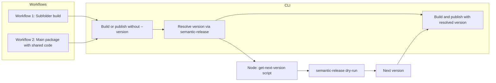

# Optional --version with semantic-release (both workflows)

## Scope: two workflows

1. **Workflow 1 – Publishing a subfolder** (monorepo): Build and publish a subfolder of `src/` as its own package. Version today is required via `--version`.
2. **Workflow 2 – Building packages with shared code**: Build the main package (e.g. `src/my_package/`) that imports from `shared/`. Version today comes from `pyproject.toml` (dynamic or static) or `--version` when publishing.

Both workflows should support **optional `--version**`: when omitted, resolve the next version via semantic-release and use it for the build/publish.

## Current behavior

- **CLI** ([`python_package_folder.py`](src/python_package_folder/python_package_folder.py)): For subfolder builds, `--version` is required; the tool exits with an error if it is missing (lines 158–164). For main-package builds, `--version` is optional; version comes from `pyproject.toml` or user.
- **Manager** ([`manager.py`](src/python_package_folder/manager.py)): `prepare_build` defaults version to `"0.0.0"` with a warning when `version` is `None` for subfolders (lines 232–239). `build_and_publish` raises `ValueError` if `version` is missing for a subfolder build (lines 1254–1258). For main package, `version` can be None (no error); then publish uses whatever the build produced (dynamic versioning or static from pyproject).
- **Publisher** ([`publisher.py`](src/python_package_folder/publisher.py)): Filters dist files by `package_name` and `version`; both are required for reliable filtering.

## Target behavior

- `**--version` optional for both workflows**: If `--version` is not provided and a version is needed (subfolder build, or main-package publish), compute the next version using semantic-release, then proceed with that version. If provided, keep current behavior (explicit version).
- **Workflow 1 (subfolder)**: Per-package tags `{package-name}-v{version}` and commits filtered to the subfolder path.
- **Workflow 2 (main package)**: Repo-level tags (e.g. `v{version}`), no path filter; run semantic-release from project root.

## Architecture

- **Version resolution**: When `--version` is missing and needed (subfolder build, or main-package publish), call a Node script that runs semantic-release in dry-run and prints the next version to stdout.
  - **Workflow 1**: Script runs with subfolder path and package name → per-package tag format and path-filtered commits (semantic-release-commit-filter).
  - **Workflow 2**: Script runs from project root, no path filter → default tag format `v{version}`; package name from `pyproject.toml` for Publisher filtering only.
- **Fallback**: If Node/semantic-release is unavailable or semantic-release decides there is no release, fail with a clear message and suggest installing semantic-release (and commit-filter for subfolders) or passing `--version` explicitly.

## Implementation options for “get next version”

- **Option A (recommended): Small Node script using semantic-release API**  

Add a script (e.g. `scripts/get-next-version.cjs` or under `.release/`) that:

  - Takes args: project root, subfolder path (relative or absolute), package name.
  - Ensures a minimal `package.json` exists in the subfolder (or in a temp location with correct `name`) so that semantic-release-commit-filter can use `package.name` for `tagFormat` and filter commits by cwd.
  - Requires semantic-release and semantic-release-commit-filter, runs semantic-release programmatically with `dryRun: true`, and prints `nextRelease.version` (or “none”) to stdout.  

This avoids parsing human-oriented dry-run output and gives a single, stable contract.

- **Option B: Parse `npx semantic-release --dry-run` output**  

Run the CLI in dry-run and parse stdout. Possible but brittle (format can change, localization, etc.). Not recommended.

## Key implementation details

1. **Where to run semantic-release**

Run from the **subfolder** directory so that semantic-release-commit-filter’s “current directory” is the subfolder and commits are filtered to that path. Tag format will be `{package.name}-v${version}` from the `package.json` in that directory.

2. **Temporary `package.json` in subfolder**

Python subfolders usually have no `package.json`. Create a temporary one for the version resolution only: `{"name": "<package_name>"}` (same name as used for the Python package). Run semantic-release from the subfolder, then remove the temp file (or overwrite only if we created it). Document that the script may create/remove `package.json` in the subfolder so users are not surprised.

3. **Dependencies**

  - No new Python dependencies.  
  - Document that **Node.js** and **npm** (or **npx**) must be available when using auto-versioning.  
  - Document (and optionally script) install of semantic-release and semantic-release-commit-filter, e.g. `npm install -g semantic-release semantic-release-commit-filter` or per-repo `package.json` with these as devDependencies.

4. **CLI flow**

  - If subfolder build and `args.version` is None:  
    - Call the version resolver (subprocess: `node scripts/get-next-version.cjs <project_root> <subfolder_path> <package_name>`).  
    - If resolver returns a version string: use it for the rest of the flow.  
    - If resolver returns “none” or fails (no release / semantic-release not found / Node error): exit with a clear error suggesting to pass `--version` or to install and configure semantic-release.
  - Pass the resolved or explicit version into `build_and_publish` / `prepare_build` as today.

5. **Manager / Publisher**

No change to the contract: they still receive a concrete `version` (either from CLI or from the resolver). Only the CLI and the new resolution step change.

6. **Convention**

Rely on default Angular/conventional commit rules (e.g. `fix:` → patch, `feat:` → minor, `BREAKING CHANGE:` → major). Document that conventional commits are required for auto-versioning; no change to commit format inside this repo unless you add a config file for semantic-release.

## Files to add or touch

| Item       | Action                                                                                                                                                                                                                                                                                                          |

| ---------- | --------------------------------------------------------------------------------------------------------------------------------------------------------------------------------------------------------------------------------------------------------------------------------------------------------------- |

| New script | Add `scripts/get-next-version.cjs` (or similar) that runs semantic-release in dry-run with commit-filter and prints next version.                                                                                                                                                                               |

| CLI        | In [`python_package_folder.py`](src/python_package_folder/python_package_folder.py): when `is_subfolder and not args.version`, call the resolver; on success set `args.version` (or a local variable) to the resolved version; on failure exit with error. Remove the “version required” error for this case.   |

| Manager    | In [`manager.py`](src/python_package_folder/manager.py): keep the `ValueError` when `version` is None for subfolder in `build_and_publish` (CLI will always pass a version after resolution). Optionally keep or adjust the “default 0.0.0” in `prepare_build` for programmatic callers who still omit version. |

| Docs       | Update README (and any publishing doc) to describe: `--version` optional for subfolders when semantic-release is used, per-package tags, conventional commits, and Node/npm + semantic-release (and commit-filter) setup.                                                                                       |

| Tests      | Add tests for: CLI with subfolder and no `--version` (mock or skip if Node/semantic-release missing), and for the resolver helper (or script) when given a fixture repo with tags and conventional commits.                                                                                                     |

## Open decisions

- **Script location**: Ship `get-next-version.cjs` inside this repo under `scripts/` (or `.release/`) so that `python-package-folder` can invoke it without requiring the user to add it. The script will `require('semantic-release')` and `require('semantic-release-commit-filter')`; users must have these installed (globally or in a local `package.json` at project root or subfolder).
- **First release / no tag**: If there is no tag for this package yet, semantic-release will use an initial version (e.g. 1.0.0). Confirm desired behavior (e.g. configurable first version or always 1.0.0).
- **No release (no relevant commits)**: If semantic-release determines there is no release, the script should output something like “none” and the CLI should exit with a clear message rather than defaulting to 0.0.0.

## Summary

- Make `--version` optional for subfolder builds by resolving the next version via Node.js semantic-release with per-package tags and path-filtered commits.
- Add a small Node script that runs semantic-release in dry-run and prints the next version; wire it from the CLI when `--version` is omitted.
- Document Node/npm and semantic-release (and semantic-release-commit-filter) as requirements for this mode, and keep explicit `--version` as the fallback when auto-versioning is not available or not desired.