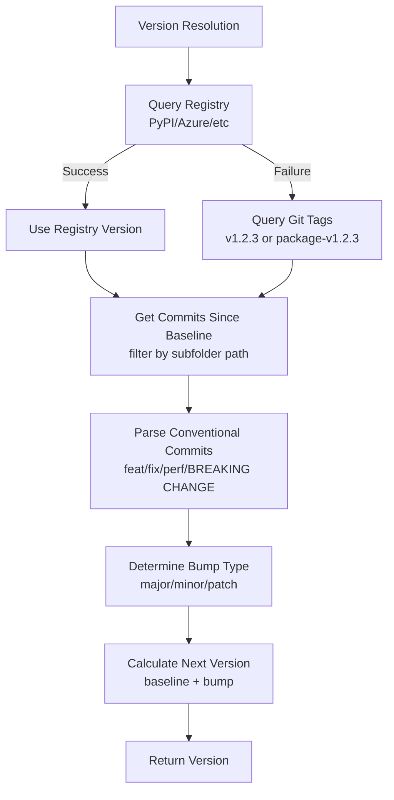

# Replace Node.js semantic-release with Custom Python Implementation

## Overview

Replace the Node.js `semantic-release` implementation with a pure Python solution that:

- Calculates next version from conventional commits (no push permissions needed)
- Queries registries (PyPI/TestPyPI/Azure) for baseline versions
- Filters commits by subfolder path for monorepo support
- Eliminates Node.js dependency

## Architecture

```
┌─────────────────────────────────────────────────────────────┐
│                    Version Resolution Flow                    │
└─────────────────────────────────────────────────────────────┘
                              │
                              ▼
        ┌─────────────────────────────────────┐
        │  Query Registry (PyPI/Azure/etc)     │
        │  for latest published version        │
        └─────────────────────────────────────┘
                      │
        ┌─────────────┴─────────────┐
        │                           │
        ▼                           ▼
    Success                      Failure
        │                           │
        ▼                           ▼
  Use registry              Query Git Tags
    version                 (v1.2.3 or
        │                   package-v1.2.3)
        │                           │
        └─────────────┬─────────────┘
                      │
                      ▼
        ┌─────────────────────────────┐
        │  Get commits since baseline │
        │  (filter by subfolder path) │
        └─────────────────────────────┘
                      │
                      ▼
        ┌─────────────────────────────┐
        │  Parse conventional commits │
        │  (feat/fix/BREAKING CHANGE) │
        └─────────────────────────────┘
                      │
                      ▼
        ┌─────────────────────────────┐
        │  Determine bump type        │
        │  (major/minor/patch)        │
        └─────────────────────────────┘
                      │
                      ▼
        ┌─────────────────────────────┐
        │  Calculate next version     │
        │  (baseline + bump)          │
        └─────────────────────────────┘
```

## Implementation Details

### 1. Create New Python Module: `src/python_package_folder/version_calculator.py`

**Functions to implement:**

- `query_registry_version(package_name: str, repository: str, repository_url: str | None = None) -> str | None`
  - Query PyPI/TestPyPI JSON API (`https://pypi.org/pypi/{package}/json`)
  - Query Azure Artifacts (basic support, fallback on failure)
  - Return latest version string or None

- `get_latest_git_tag(project_root: Path, package_name: str | None = None, is_subfolder: bool = False) -> str | None`
  - For main package: look for tags matching `v{version}` (e.g., `v1.2.3`)
  - For subfolder: look for tags matching `{package-name}-v{version}` (e.g., `my-package-v1.2.3`)
  - Use `git tag --list` and parse version from tag
  - Return latest version or None

- `get_commits_since(project_root: Path, baseline_version: str, subfolder_path: Path | None = None) -> list[str]`
  - Use `git log --oneline` to get commits since baseline
  - If `subfolder_path` provided, use `git log -- <subfolder_path>` to filter
  - Return list of commit messages

- `parse_commit_for_bump(commit_message: str) -> str | None`
  - Parse conventional commit format following [Angular Commit Message Conventions](https://github.com/angular/angular/blob/main/contributing-docs/commit-message-guidelines.md) as used by semantic-release
  - Return `"major"`, `"minor"`, `"patch"`, or `None`
  - **Breaking Change Detection (Major bump):**
    - `BREAKING CHANGE:` in commit footer (body)
    - `!` after type/scope: `feat!:`, `feat(scope)!:`, `fix!:`, etc.
  - **Version Bump Rules:**
    - `feat:` → `minor` (new feature)
    - `fix:` → `patch` (bug fix)
    - `perf:` → `patch` (performance improvement)
    - **No version bump** (ignored): `docs:`, `style:`, `refactor:`, `test:`, `build:`, `ci:`, `chore:`, `revert:`
  - All commit types supported by semantic-release Angular preset are recognized, but only `feat`, `fix`, and `perf` affect version bumps

- `calculate_next_version(baseline_version: str, commits: list[str], subfolder_path: Path | None = None) -> str | None`
  - Get commits since baseline (filtered by subfolder if needed)
  - Parse each commit for bump type
  - Determine highest bump (major > minor > patch)
  - Increment version: `1.2.3` + `minor` → `1.3.0`
  - Return next version or None if no changes

- `resolve_version(project_root: Path, package_name: str | None = None, subfolder_path: Path | None = None, repository: str | None = None, repository_url: str | None = None) -> tuple[str | None, str | None]`
  - Main entry point (replaces `resolve_version_via_semantic_release`)
  - Try registry query first, fallback to git tags
  - Calculate next version from commits
  - Return `(version, error_message)` tuple

### 2. Update `src/python_package_folder/python_package_folder.py`

**Changes:**

- Replace `resolve_version_via_semantic_release()` call with `resolve_version()` from `version_calculator`
- Remove `check_node_available()` function (no longer needed)
- Remove Node.js error messages
- Update imports: `from python_package_folder.version_calculator import resolve_version`

### 3. Remove Node.js Dependencies

**Files to delete:**

- `src/python_package_folder/scripts/get-next-version.cjs`
- `scripts/get-next-version.cjs` (if exists)

**Files to update:**

- `pyproject.toml`: Remove any references to Node.js scripts in build hooks
- `src/python_package_folder/_hatch_build.py`: Remove script inclusion logic (if present)
- `MANIFEST.in`: Remove script inclusion (if present)

### 4. Update Documentation: `README.md`

**Sections to update:**

- **"Automatic Version Resolution" section:**
  - Remove Node.js/semantic-release setup instructions
  - Update to describe Python-native implementation
  - Keep registry query explanation
  - Update commit filtering explanation (now native Python)
  - **Add architecture diagram** (mermaid format) showing version resolution flow:


  - **Add "Supported Commit Types" subsection:**
    - Document all Angular commit types supported (following [Angular Commit Message Conventions](https://github.com/angular/angular/blob/main/contributing-docs/commit-message-guidelines.md) as used by [semantic-release](https://semantic-release.gitbook.io/semantic-release/))
    - **Version Bump Types:**
      - `feat:` → **Minor** (new feature)
      - `fix:` → **Patch** (bug fix)
      - `perf:` → **Patch** (performance improvement)
      - Breaking changes (any type with `!` or `BREAKING CHANGE:` footer) → **Major**
    - **Ignored Types** (no version bump): `docs:`, `style:`, `refactor:`, `test:`, `build:`, `ci:`, `chore:`, `revert:`
    - **Breaking Change Detection:**
      - `BREAKING CHANGE:` in commit footer/body
      - `!` after type: `feat!:`, `fix!:`, `feat(scope)!:`
    - Include examples for each bump type with actual commit message examples
    - Reference: "This implementation follows the same conventions as [semantic-release](https://semantic-release.gitbook.io/semantic-release/) using the Angular preset"

- **"Requirements" section:**
  - Remove: "Install semantic-release globally"
  - Remove: "Install semantic-release-commit-filter"
  - Keep: "Conventional commits required"
  - Add note: "Follows [Angular Commit Message Conventions](https://github.com/angular/angular/blob/main/contributing-docs/commit-message-guidelines.md) as used by [semantic-release](https://semantic-release.gitbook.io/semantic-release/)"

- **"Subfolder Versioning" section:**
  - Update to reflect Python-native commit filtering
  - Remove references to `semantic-release-commit-filter`

### 5. Add Tests: `tests/test_version_calculator.py`

**Test cases:**

- `test_query_pypi_version()` - Mock HTTP request to PyPI API
- `test_query_testpypi_version()` - Mock HTTP request to TestPyPI API
- `test_query_azure_artifacts_version()` - Mock Azure Artifacts request (basic)
- `test_get_latest_git_tag_main_package()` - Test `v1.2.3` tag parsing
- `test_get_latest_git_tag_subfolder()` - Test `package-v1.2.3` tag parsing
- `test_get_commits_since()` - Test git log filtering
- `test_get_commits_since_with_subfolder()` - Test subfolder path filtering
- `test_parse_commit_for_bump_major_breaking_footer()` - Test `BREAKING CHANGE:` in footer
- `test_parse_commit_for_bump_major_exclamation()` - Test `feat!:`, `fix!:` syntax
- `test_parse_commit_for_bump_major_exclamation_with_scope()` - Test `feat(scope)!:` syntax
- `test_parse_commit_for_bump_minor()` - Test `feat:` detection
- `test_parse_commit_for_bump_patch_fix()` - Test `fix:` detection
- `test_parse_commit_for_bump_patch_perf()` - Test `perf:` detection
- `test_parse_commit_for_bump_none()` - Test ignored commit types (docs, style, refactor, test, build, ci, chore, revert)
- `test_calculate_next_version_patch()` - Test version increment (1.2.3 → 1.2.4)
- `test_calculate_next_version_minor()` - Test version increment (1.2.3 → 1.3.0)
- `test_calculate_next_version_major()` - Test version increment (1.2.3 → 2.0.0)
- `test_calculate_next_version_no_changes()` - Test None when no relevant commits
- `test_resolve_version_registry_first()` - Integration test with registry query
- `test_resolve_version_git_fallback()` - Integration test with git tag fallback
- `test_resolve_version_subfolder()` - Integration test for subfolder builds

**Test utilities:**

- Use `pytest` fixtures for temporary git repositories
- Use `unittest.mock` to mock HTTP requests and git commands
- Use `subprocess` mocking for git commands

### 6. Update Integration Tests

**Files to check:**

- `tests/test_subfolder_build.py` - May need updates if it tests version resolution
- Any other tests that mock or test `resolve_version_via_semantic_release`

### 7. Dependencies

**Add to `pyproject.toml` (if not already present):**

- `requests>=2.0.0` (for registry queries - already in lock file)

**Remove:**

- Any Node.js/npm related dependencies or build hooks

## Testing Strategy

1. **Unit tests**: Test each function in isolation with mocks
2. **Integration tests**: Test full version resolution flow with temporary git repos
3. **Manual testing**: Test against this repository's actual git history
4. **CI testing**: Ensure tests pass in GitHub Actions (no Node.js needed)

## Migration Notes

- **Backward compatibility**: The function signature `resolve_version()` matches the old `resolve_version_via_semantic_release()` signature, so CLI code doesn't need changes
- **Error messages**: Update error messages to remove Node.js references
- **Documentation**: Update all docs to reflect Python-native approach

## Files to Create/Modify

**New files:**

- `src/python_package_folder/version_calculator.py` (~300-400 lines)

**Modified files:**

- `src/python_package_folder/python_package_folder.py` (replace function call, remove Node.js checks)
- `README.md` (update documentation)
- `tests/test_version_calculator.py` (new test file)

**Deleted files:**

- `src/python_package_folder/scripts/get-next-version.cjs`
- `scripts/get-next-version.cjs` (if exists)

**Potentially modified:**

- `pyproject.toml` (remove build hooks for scripts)
- `src/python_package_folder/_hatch_build.py` (remove script inclusion)
- `MANIFEST.in` (remove script inclusion)