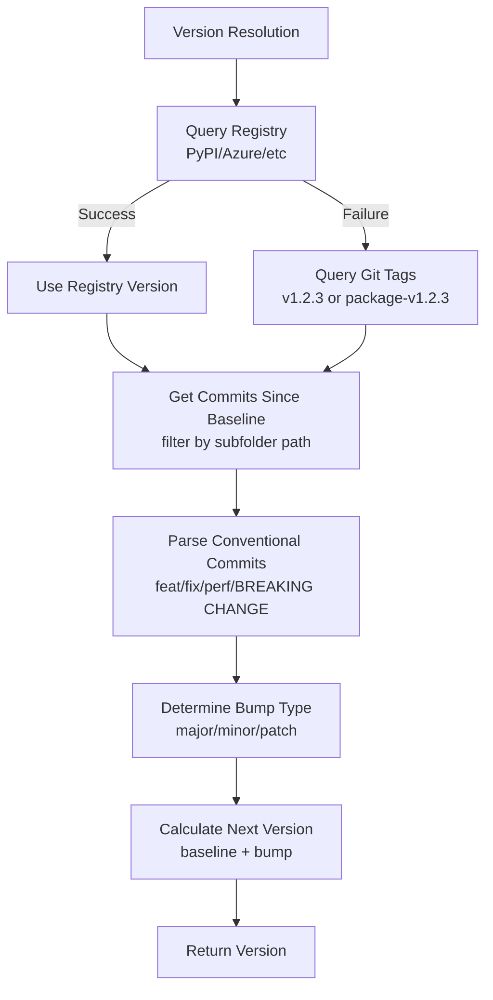

# Version Resolution

The package supports both dynamic versioning (from git tags) and manual version specification.

## Manual Version Setting

You can manually set a version before building and publishing:

```bash
# Build with a specific version
python-package-folder --version "1.2.3"

# Build and publish with a specific version
python-package-folder --version "1.2.3" --publish pypi

# Keep the static version (don't restore dynamic versioning)
python-package-folder --version "1.2.3" --no-restore-versioning
```

The `--version` option:
- Sets a static version in `pyproject.toml` before building
- Temporarily removes dynamic versioning configuration
- Restores the original configuration after build (unless `--no-restore-versioning` is used)
- Validates version format (must be PEP 440 compliant)

**Version Format**: Versions must follow PEP 440 (e.g., `1.2.3`, `1.2.3a1`, `1.2.3.post1`, `1.2.3.dev1`)

## Automatic Version Resolution

When `--version` is not provided, the tool automatically determines the next version using conventional commits. This is a **Python-native implementation** that follows the same conventions as [semantic-release](https://semantic-release.gitbook.io/semantic-release/) using the Angular preset, but requires no Node.js dependencies.

**Version Resolution Flow:**



**Version Detection:**
- **Baseline version**:
  - **Registry Query (Preferred)**: When publishing to a repository (PyPI, TestPyPI, or Azure Artifacts), the tool queries the target registry for the latest published version and uses it as the baseline for version calculation. This ensures version calculations are based on what's actually published, not just git tags.
  - **Git Tags (Fallback)**: If the package doesn't exist on the registry yet (first release) or if registry query fails, the tool falls back to using git tags to determine the starting version.
- **New version to publish**: After determining the baseline version, the tool analyzes commits since that version to calculate the next version bump (major, minor, or patch) based on [conventional commit](https://www.conventionalcommits.org/en/v1.0.0/) messages.

**For subfolder builds (Workflow 1):**
- Uses per-package tags: `{package-name}-v{version}` (e.g., `my-package-v1.2.3`)
- Queries the target registry for the latest published version of the subfolder package
- Filters commits to only those affecting the subfolder path using native Python git commands
- **Commit filtering behavior**: Only commits that modify files within the subfolder path are considered for version calculation. Commits that only target files outside the subfolder are excluded. For example:
  - `fix: update my_subfolder/foo.py` → **Included** (affects subfolder)
  - `feat: add feature to other_package/bar.py` → **Excluded** (doesn't affect subfolder)
  - `fix: update my_subfolder/baz.py and shared/utils.py` → **Included** (affects subfolder, even if it also touches files outside)

**For main package builds (Workflow 2):**
- Uses repo-level tags: `v{version}` (e.g., `v1.2.3`)
- Queries the target registry for the latest published version when publishing
- Analyzes all commits in the repository

**Registry Support:**
- **PyPI**: Fully supported via JSON API (`https://pypi.org/pypi/{package-name}/json`)
- **TestPyPI**: Fully supported via JSON API (`https://test.pypi.org/pypi/{package-name}/json`)
- **Azure Artifacts**: Basic support with fallback to git tags. Azure Artifacts uses a different API format and may require authentication, so if the query fails, the tool automatically falls back to git tags.

**Supported Commit Types:**

This implementation follows [Angular Commit Message Conventions](https://github.com/angular/angular/blob/main/contributing-docs/commit-message-guidelines.md) as used by [semantic-release](https://semantic-release.gitbook.io/semantic-release/). All commit types are recognized, but only certain types trigger version bumps:

**Version Bump Types:**
- `feat:` → **Minor** (new feature)
  - Example: `feat: add user authentication`
  - Example: `feat(api): add new endpoint`
- `fix:` → **Patch** (bug fix)
  - Example: `fix: resolve memory leak in data processor`
  - Example: `fix(parser): handle empty input correctly`
- `perf:` → **Patch** (performance improvement)
  - Example: `perf: optimize database queries`
  - Example: `perf(cache): reduce cache lookup time`
- **Breaking changes** (any type with `!` or `BREAKING CHANGE:` footer) → **Major**
  - Example: `feat!: remove deprecated API`
  - Example: `feat(api)!: change response format`
  - Example: `fix: update dependency\n\nBREAKING CHANGE: minimum Python version is now 3.11`

**Ignored Types** (no version bump):
- `docs:` - Documentation only changes
- `style:` - Code style changes (formatting, missing semicolons, etc.)
- `refactor:` - Code refactoring (neither fixes a bug nor adds a feature)
- `test:` - Adding or updating tests
- `build:` - Changes to build system or external dependencies
- `ci:` - Changes to CI configuration files and scripts
- `chore:` - Other changes that don't modify src or test files
- `revert:` - Reverts a previous commit

**Breaking Change Detection:**
- `BREAKING CHANGE:` in commit footer/body (case-insensitive)
- `!` after type/scope: `feat!:`, `fix!:`, `feat(scope)!:`, etc.

**Usage:**
```bash
# Subfolder build - version resolved automatically
cd src/my_subfolder
python-package-folder --publish pypi

# Main package - version resolved automatically
python-package-folder --publish pypi
```

**Requirements:**
- Conventional commits (e.g., `fix:`, `feat:`, `BREAKING CHANGE:`) are required for version calculation
- The tool will fall back to requiring `--version` explicitly if no baseline version is found or no relevant commits are detected

## Subfolder Versioning

When building from a subdirectory (not the main `src/` directory), the tool automatically detects the subfolder and sets up the build configuration:

```bash
# Build a subfolder as a separate package with explicit version
cd my_project/subfolder_to_build
python-package-folder --version "1.0.0" --publish pypi

# Or let the tool determine the version automatically from conventional commits
python-package-folder --publish pypi

# With custom package name
python-package-folder --version "1.0.0" --package-name "my-custom-name" --publish pypi
```

For subfolder builds:
- **Automatic detection**: The tool automatically detects subfolder builds
- **Version resolution**: 
  - If `--version` is provided: Uses the explicit version
  - If `--version` is omitted: Attempts to resolve via conventional commits
  - If no baseline version is found or no relevant commits: Requires `--version` explicitly
- **pyproject.toml handling**:
  - If `pyproject.toml` exists in subfolder: Uses that file (copied to project root temporarily)
  - If no `pyproject.toml` in subfolder: Creates temporary one with correct package structure
- **Package name**: Automatically derived from the subfolder name (e.g., `subfolder_to_build` → `subfolder-to-build`). Only used when creating temporary pyproject.toml.
- **Restoration**: Original `pyproject.toml` is restored after build
- **Temporary configuration**: Creates a temporary `pyproject.toml` with:
  - Custom package name (from `--package-name` or derived)
  - Specified or resolved version
  - Correct package path for hatchling
  - Dependency group from parent (if `--dependency-group` is specified)
- **Package initialization**: Automatically creates `__init__.py` if the subfolder doesn't have one (required for hatchling)
- **README handling**: 
  - If a README file exists in the subfolder, it will be used instead of the parent README
  - If no README exists in the subfolder, a minimal README with just the folder name will be created
- **Auto-restore**: Original `pyproject.toml` is restored after build, and temporary `__init__.py` files are removed

## Python API for Version Management

```python
from python_package_folder import VersionManager
from pathlib import Path

# Set a version
version_manager = VersionManager(project_root=Path("."))
version_manager.set_version("1.2.3")

# Get current version
current_version = version_manager.get_current_version()

# Restore dynamic versioning
version_manager.restore_dynamic_versioning()
```

## Dynamic Versioning

By default, the package uses `uv-dynamic-versioning` which derives versions from git tags. This is configured in `pyproject.toml`:

```toml
[project]
dynamic = ["version"]

[tool.hatch.version]
source = "uv-dynamic-versioning"

[tool.uv-dynamic-versioning]
vcs = "git"
style = "pep440"
bump = true
```

When you use `--version`, the package temporarily switches to static versioning for that build, then restores the dynamic configuration.
